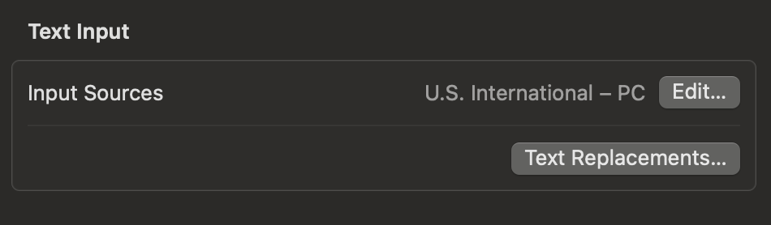

# Changing Dutch layout to PT-BR with Karabiner

### At the Keyboard page at the Macbook settings
Change the text input source to "U.S. - International - PC"

### Simple modifications page
Add the following rules:
- non_use_backslash -> grave_accent_and_tiled
- grave_accent_and_tiled -> non_use_backslash

### Virtual Keyboard
Change the "keyboard type" to ANSI

